# HealthTrack

A fitness and habit-tracking web application to help users maintain consistency in their wellness goals.

**Group:** Ethan Phillips, Jonathan Pearson, Samuel Hale

---

## Prerequisites

- **Node.js** (v18+)
- **PostgreSQL** (v14+)

---

## Database Setup

1. **Start PostgreSQL:**
   ```bash
   sudo service postgresql start
   ```

2. **Create user and database:**
   ```bash
   sudo -u postgres createuser postgres -s
   sudo -u postgres createdb healthtrack
   sudo -u postgres psql -c "ALTER USER postgres WITH PASSWORD 'postgres';"
   ```
   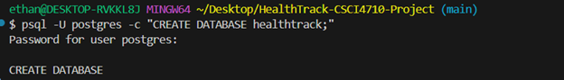
   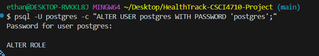
3. **Run the schema:**
    ```bash
    psql -d healthtrack -f Backend/schema.sql
    ```
    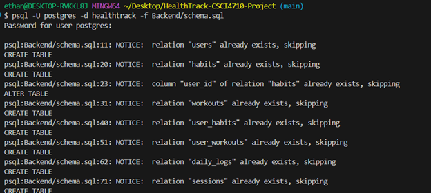

4. **(Optional) Add seed data:**
    ```bash
    psql -d healthtrack -f Backend/seed.sql
    ```
    Creates sample users (password: `Test1234`), workouts, habits, and logged workouts.
   
   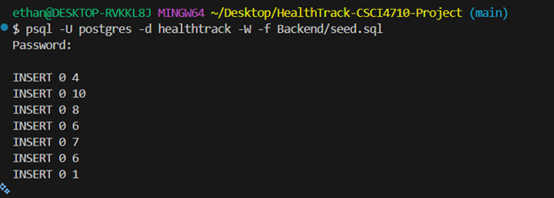
---

## Backend Setup

1. **Install dependencies:**
   ```bash
   cd Backend
   npm install
   ```
   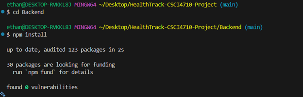

2. **Configure environment:**
   
   Edit `Backend/.env`:
   ```
   PORT=3000
   DB_HOST=127.0.0.1
   DB_PORT=5432
   DB_USER=postgres
   DB_PASSWORD=postgres
   DB_NAME=healthtrack
   JWT_SECRET=your_secret_key
   ```

3. **Start the server:**
   ```bash
   npm start
   ```
   Server runs at `http://localhost:3000`

   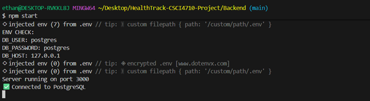

---
   
## API Documentation

Full OpenAPI 3.0 specification is available in [`Backend/openapi.yaml`](Backend/openapi.yaml).

You can view the API documentation using:
- **Swagger Editor**: Paste the YAML content at https://editor.swagger.io/ or while backend is running at http://localhost:3000/api-docs/
- **Redoc**: Use https://redocly.github.io/redoc/
- **Local tools**: Use `npx @redocly/cli preview-docs Backend/openapi.yaml`

### Quick API Reference

| Method | Endpoint | Description |
|--------|----------|-------------|
| POST | `/users` | Register new user  |
| POST | `/users/login` | Login (returns JWT) |  |
| POST | `/users/logout` | Logout (requires auth) |
| GET | `/users/session` | Get current session (requires auth) |
| GET | `/todo/habits` | Get current user's habits |
| POST | `/todo/habits` | Create habit for current user |
| PUT | `/todo/habits/:id` | Update current user's habit |
| DELETE | `/todo/habits/:id` | Delete current user's habit |
| GET | `/todo/workouts` | Get all workouts (Exercise Library) |
| POST | `/todo/workouts` | Create workout (Admin, requires auth) |
| GET | `/todo/my-habits` | Get current user's habits (requires auth) |
| POST | `/todo/my-habits` | Create habit for current user |
| GET | `/todo/my-workouts` | Get user's workout history (requires auth) |
| POST | `/todo/my-workouts` | Log a workout (requires auth) |
| GET | `/todo/daily-log` | Get today's habits with status (requires auth) |
| POST | `/todo/daily-log` | Toggle habit completion (requires auth) |
| GET | `/todo/admin/metrics` | Get platform metrics (Admin, requires auth) |

**Authentication:** Include JWT in header: `Authorization: Bearer <token>`

---

## Frontend Setup

1. **Install dependencies:**
   ```bash
   cd Frontend
   npm install
   ```
   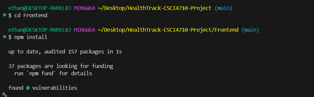
]
2. **Start the development server:**
   ```bash
   npm run dev
   ```
   Frontend runs at `http://localhost:5173`

   


---

## Running the Application

1. Start PostgreSQL: `sudo service postgresql start`
2. Start Backend: `cd Backend && npm start`

3. Start Frontend: `cd Frontend && npm run dev`
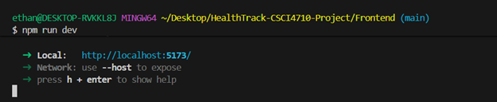
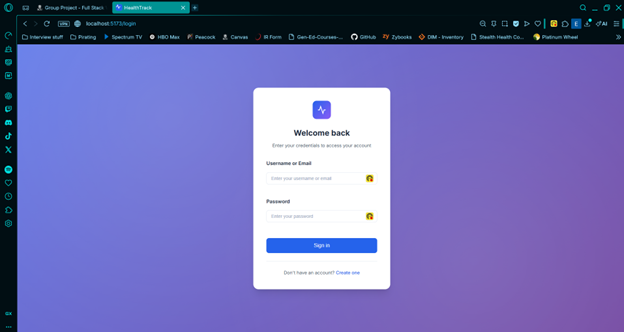

### Demo Account
- **Username:** demo@test.com
- **Password:** demo1234
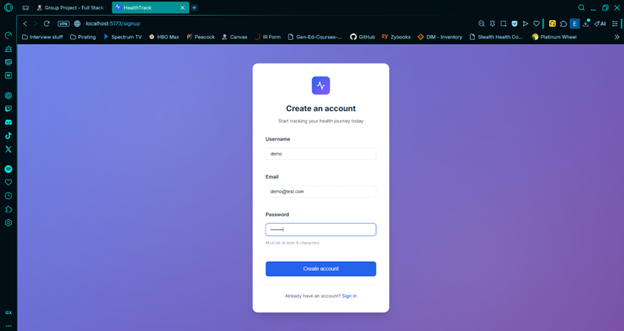
### Creating an Admin User
After registering, update the user's role in the database:
```sql
UPDATE users SET role = 'Admin' WHERE username = 'your_username';
```
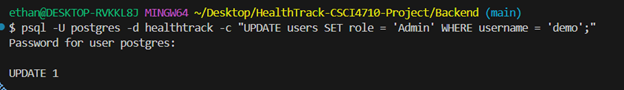

---

## Project Structure

```
HealthTrack/
├── Backend/
│   ├── src/
│   │   ├── server.js      # Express server
│   │   ├── db.js        # PostgreSQL connection
│   │   ├── auth.js     # JWT middleware
│   │   ├── middleware/
│   │   │   └── errorHandler.js
│   │   └── routes/
│   │       ├── users.js   # User endpoints
│   │       ├── todo.js  # Habits/Workouts endpoints
│   │       └── home.js # Home dashboard
│   ├── schema.sql
│   ├── openapi.yaml    # API documentation (OpenAPI 3.0)
│   └── package.json
├── Frontend/
│   ├── src/
│   │   ├── main.jsx          # App entry
│   │   ├── App.jsx           # Routes
│   │   ├── context/
│   │   │   └── AuthContext.jsx # Auth state
│   │   ├── components/
│   │   │   ├── Navbar.jsx
│   │   │   └── ProtectedRoute.jsx
│   │   └── pages/
│   │       ├── Login.jsx
│   │       ├── SignUp.jsx
│   │       ├── Dashboard.jsx
│   │       ├── HabitManager.jsx
│   │       ├── WorkoutHistory.jsx
│   │       ├── Admin.jsx
│   │       └── Profile.jsx
│   └── package.json
└── README.md
```
